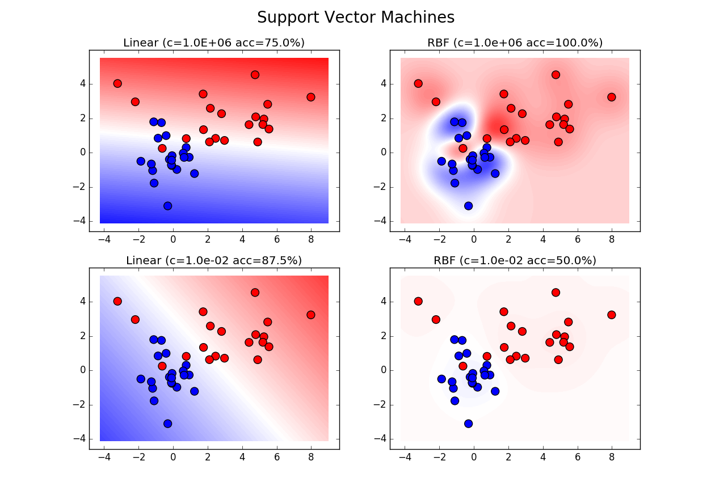

# Support Vector Machines for Cython

a basic example using C++ class in Cython

usage:


```
$ python setup.py test
$ python setup.py build
timtit: Benchmark(num=100, dim=2).fit_sk()
> 0.19173218501964584 sec 100 trials
timtit: Benchmark(num=100, dim=2).fit_cy()
> 2.2094863159873057 sec 100 trials
```

