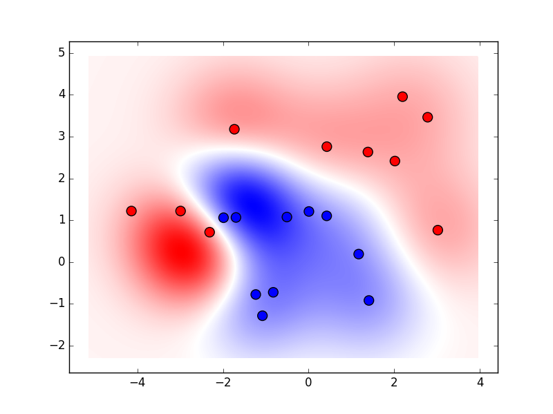

# Support Vector Machines for Cython

a basic example using C++ class in Cython

usage:

```
$ python setup.py install
$ python test.py
$ ipython
In [1]: %run ./benchmark.py
In [2]: b = Benchmark()
In [3]: %timeit b.fit_cy() # cy-svm's SVM
The slowest run took 4.30 times longer than the fastest. This could mean that an intermediate result is being cached.
1000 loops, best of 3: 794 µs per loop
In [4]: %timeit b.fit_sk() # sklearn's SVM
The slowest run took 7.70 times longer than the fastest. This could mean that an intermediate result is being cached.
1000 loops, best of 3: 354 µs per loop
```



